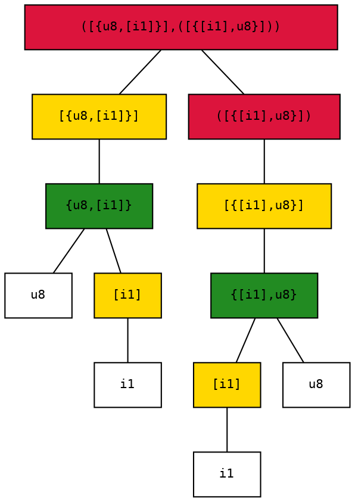
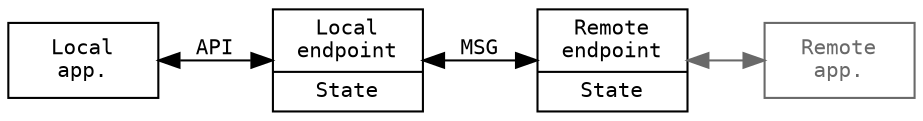

Lighweight Remote Procedure Calls
=================================

The solution can be split into two main functional levels:

 - A platform and language agnostic serialization format that enables transforming structured data to and from a byte sequence.
 - An established protocol that uses these serialized messages to implement higher level functions.

 ```dot
graph G
{
    node [shape=record, penwidth=0.5, fontcolor="dimgray",style=filled,fillcolor="#eeeeee", fontname="mono", fontsize=12, width=2];
    edge [color="dimgray"];
    app[label="Application"]
    rpc[shape=record, label="{RPC protocol|Serialization \nsublayer}", penwidth=1, fontcolor="",fillcolor="palegoldenrod"]
    tcp[label="{Message\ntransport\nadapter|Byte stream \ntransport}"]
    udp[label="{Message\ntransport\nadapter|Datagram \ntransport}"]

    app--rpc []
    rpc--tcp
    rpc--udp
}
 ```

 Serialization
 -------------

 The serialization part of the solution utilizes a strongly typed data representation, meaning that it defines an abstract (language independent) data type system where each message has an associated type that defines its logical structure and the corresponding serialization rules.

 The structure of the data is represented at the endpoints in a source language specific way, that can be different on each end. Only the serialization type system needs to harmonized with the supported source languages not each of language with all others.

 ```dot
 digraph G
 {
    rankdir="LR"
    node[shape=rectangle,style=filled,fillcolor="#eeeeee",fontname="mono",fontsize=12, width=1.3]
    common[label="Abstract\ntype-system",fillcolor="palegoldenrod"]
    edge[dir="both"]
    "C#" -> common
    "Python" -> common
    "Rust" -> common
    common -> "C++"
    common -> "Js"
    common -> "..."
 }
 ```

 Messages can only be (de)serialized knowing their type, in other words the messages are not self-describing. The purpose of this serialization format is to serve the needs of the RPC protocol, ergo the messages are not meant to be processed out of context. It has obvious performance benefits to spare the extra resources that could be used to send meta-information already known by the intended target.

### Type system

All types can be represented as a tree, whose nodes can be aggregates, collections, typed method handles or primitive types (at the leaves only).

#### Nodes

|            |  Children  |  Textual representation  |
| ---------- | ---------- | ------------------------ |
| Integral   |      -     |  **i1**, **u1**, **i2**, **u2**, **i4**, ... |
| Aggregate  |  Members   |  {_T_, _U_, _V_, ...}          |
| Collection |  Elements  |  [_T_]                     |
| Method     |  Arguments |  (_T_, _U_, _V_, ...)          |

##### Integral primitives

There are eight integral primitives, representing signed/unsigned integral values of 1, 2, 4 and 8 bytes.

##### Aggregates 

An aggregate is a compund data record consisting of a list of values with predefined types and order between them. It is similar to a C/C++/C# _struct_.

The aggregate type-node can have zero or more children.

##### Collection

A collection is a homogenous batch of data containing an arbitrary number of elements. Although the count of its elements is not known, the type of them must be defined in advance.

The collection type-node has exactly one child.

##### Method handle

A method handle is a type that has associated children type-nodes that represent the arguments of a function call. Contrary to the aggregate, the value it represents is not the arguments themselves but a handle that can be used to invoke a method that takes exactly those arguments.

The method type-node can have zero or more children.

#### Type signatures

For every tree of type-nodes exists a mutually unique string representation, called its type signature. The method of generating it from the type-tree is based on a depth-first traversal and per-node type specific operations.

##### Integral primitives

The string representation of an integral primitive is a literal of two characters:

 - the first of which represents signedness: **u** for unsigned and **i** (as integer) for signed;
 - the second is the size in the number of bytes used to store the value, it can be 1, 2, 4 or 8.

For example **i1** is the signature of a sigle byte signed integer (C/C++ _char_, C# _sbyte_ or Java _byte_)

##### Aggregates

The signature of an aggregate is the type signature of its children (in order), separated by a comma **,**  (without white space on either side) between curly brackets.

For example **{i4,u8}** the signature of is an aggregate that is made up of a four byte signed integer and an eight byte unsigned integer - in that order.

##### Collection

The type signature of a collection is that of its element type between square brackets.

For example **[i1]** is the signature of a collection of one byte signed integers - which could be interpreted for example as a character string by the endpoints.

##### Method handle

The signature of a method handle is the type signature of the arguments types (in order), separated by a comma **,**  (without whitespace on either side) between parentheses (round brackets).

For example **(u4, [i1])** is the signature of a handle for a method that takes a four byte unsigned integer and collection of signed single bytes - in that order.

#### Encoding

The serialized encoding of a value is determined by its type. The overall structure of the byte sequence corresponding to a value can be understood as being generated by a depth-first traversal of the type tree.

##### Integral primitives

Basic integral values are serialized using full width, least-significant-byte-first (little-endian, LSB first) encoding, which is very close to the most natural in-memory representation of modern CPUs.

_An additional requirement for efficeint CPU acces would be aligned base addresses for multi-byte values. But ensuring proper alignment could only be done by adding padding bytes in the general case, which is acceptable for in-memory usage but can easily be too wasteful for an over-the-wire format in certain bandwidth constrained usecases._

##### Aggregates 

Aggregate typed values are serialized as a sequence of its constituent member values - in order, without any additional framing.

##### Variable length encoding

Several data items are serialized using a variable length encoding, that assigns a shorter representation to smaller numbers. The serialization engine uses only 32-bit unsigned values encoded this way. These four byte values are encoded into 1-5 bytes based on the numerical value.

The encoding produces one byte at a time for 7 bit chunks of the original value. The least significant bits of the output byte are the inputs bits, the top bit signifies if there are more chunks following.

During encoding the least significant part is processed first, the last 7 bits are taken from the input:

  - if the remaining value is zero, then there are no more parts required, so the output is the 7 input bits at the lower part and a zero at the topmost bit, the processing stops.
  - if the remaining value is not zero, then there are more parts to come, so the output is the 7 input bits at the lower part and a one at the topmost bit. The processing continues the same way for the next 7 bits of the input.

| Value range        |  Input bits (as 32-bit word)     | Output bytes (in proper sequence)            |
|--------------------|----------------------------------|----------------------------------------------|
| 0 <= x < 128       | 0000000000000000000000000aaaaaaa | 0aaaaaaa                                     |
| 128 <= x < 128^2   | 000000000000000000aaaaaaabbbbbbb | 1bbbbbbb 0aaaaaaa                            |
| 128^2 <= x < 128^3 | 00000000000aaaaaaabbbbbbbccccccc | 1ccccccc 1bbbbbbb 0ccccccc                   |
| 128^3 <= x < 128^4 | 0000aaaaaaabbbbbbbcccccccddddddd | 1ddddddd 1ccccccc 1bbbbbbb 0aaaaaaa          |
| otherwise          | aaaabbbbbbbcccccccdddddddeeeeeee | 1eeeeeee 1ddddddd 1ccccccc 1bbbbbbb 0000aaaa |
 
This encoding is sometimes called LEB128 which stands for little endian base 128, as the 7 bit chunks are the digits in the radix 128 numeral system.

##### Collections 

Collections are encoded as sequence of their element values prepended by the number of contained elements using the variable length encoding specified above.

##### Method handles

Method handles are unsigned 32-bit values used by the upper protocol layer as an identifier for the actual methods to be invoked. It is using the variable length encoding specified above.

#### Example

A method that takes a set of number to string mappings, and returns string to number mappings via a callback could be represented by this signature: 

      ([{u8,[i1]}],([{[i1],u8}]))

Which is equivalent to this type tree:



Type-nodes in the figure are color coded based on their kind:

 - Red nodes are method handles,
 - Green are aggregates,
 - Yellow means collection,
 - The rest are integral primitives.

A value of this type is a 32-bit unsigned integral which is encoded using the variable length encoding scheme.

However if a method with the this signature is invoked its arguments are serialized as an aggregate of the arguments, like this:

    {[{u8,[i1]}],([{[i1],u8}])}

```ditaa {cmd=true args=["-E","-S"]}
+---------------+-----------+----------+-----------+------------+
| num elements  |  8 bytes  | strlen n |           | callback   |
| in first arg  |  unsigned | (varint) | character | identifier |
| (varint) cYEL |  integral |  cGRE    |           | (varint)   |
+---------------+-----------+----------+-----------+------------+
                |                      |           |
                | cDDD                 |  n times  |
                |                      | cGRE      |
                +----------------------+-----------+
                |                                  |
                |       num elements times         |
                | cYEL                             |
                +----------------------------------+
```

The data used in the invocation of the callback has the following byte sequence format:

    {[{[i1],u8}]}

```ditaa {cmd=true args=["-E","-S"]}
+----------------+----------+-----------+-----------+
|  num. elements | strlen n |           |  8 bytes  |
|  in collection | (varint) | character |  unsigned |
|  (varint) cYEL | cGRE     |           |  integral |
+----------------+----------+-----------+-----------+
                 |          |           |           |
                 | cDDD     |  n times  | cDDD      |
                 |          | cGRE      |           |
                 +----------+-----------+-----------+
                 |                                  |
                 |       num. elements times        |
                 | cYEL                             |
                 +----------------------------------+
```

Protocol
--------

The RPC protocol is defined in terms of endpoint state and interactions with the application and the remote endpoint.

The direction of connection establishment is irrelevant, the two ends of the connection function in exactly the same way.



The operation can be further divided in two logical layers:

 - Basic remote procedure invocation,
 - Signature based symbolic method lookup (or linking).

```ditaa {cmd=true args=["-E","-S"]}
+----------------------------------------+
|                                    cDDD|
|               Application              |
|                                        |
+-------------------------+              |
|   Symbolic linking cGRE |              |
+-------------------------+-----+        |
|   Remote invocation layer cYEL|        |
+-------------------------------+        |
|   Serialization           cPNK|        |
+-------------------------------+--------+    
|   Message transport adapter        cDDD|
+----------------------------------------+
```

### Remote procedure invocation layer

The lower protocol layer enables the remotely triggered execution of methods registered by the local application and the upper protocol layer.

#### Endpoint state

The endpoint stores internal state regarding registered methods and the associated identifiers required for remote invocation.

For each registered method there is a 32-bit unsigned numeric value that identifies the method uniquely on the endpoint. During assignment of an identifier the engine chooses the smallest possible value while also avoiding reuse as to circumvent confusion arising from different methods being registered at different times.

#### Protocol messages

Every message exchanged by the endpoints follows the same format and has the same effect as far as the invocation layer is concerned. Each message triggers the execution of a registered method at the receiving end. It contains the identifier for the method to be invoked at the receiver. The identifier is a key in the registry of of methods, so it either has to:

 - identify a well-known method or
 - be retrieved earlier from the remote endpoint.

The identifier of the method is the first item in the message followed by the arguments to be used for the invocation. These values are serialized as if they were an aggregate of a method handle and all the arguments of the method, formally it has the type signature:

    {(T...),T...}

Where **T** is the list of argument types for the target method, and _..._ means list expansion. For example if a method with a string argument is to be invoked, it becomes:

    {([i1]),[i1]]}

Upon receiving a message the endpoint deserializes method identifier at the beginning of the byte sequence and using that information it can look up the corresponding method. Using that knowledge it can deserialize the arguments and execute the target.

#### Application interface

The appliction is provided with the following operations regarding basic remote invocation functions:

 - **install** a local method to be available for remote invocation,
 - **uninstall** a previously registered method,
 - **call** a remote method registered by the remote application at the remote RPC endpoint.

### Symbolic method lookup

Type safety can be achieved by utilizing method signature based symbolic method lookup. The signature of a public method consists of a textual name and the type signature of a handle to that method.

For example a method named _foo_ receiving a list of strings has a signature:

    foo([[i1]])

_In order for an application to be able to utilize some remotely provided functionality it must known the semantics of that service, including the relevant structure of the data to be sent during invocation of remote methods. Thus, it can be assumed that it is able to issue fully qualified method signatures as a basis for looking up remote methods. It is also valid a assumption the other way around: the public interface of service can only be specified in terms of well defined data structures._

To achieve type safety, it is enough for both ends to adhere to the proper data handling procedures waranted by the signature of interface methods.

#### Related endpoint state

Exported procedures must be available for remotely triggered execution as well, so they must be registered at the invocation layer. Thus, all publicly available methods bear a valid identifier assigned to them as well. In addition to that, the endpoint stores the published methods available for lookup. The registry required for this is equivalent of a mapping from method signature to invocation identifier.

#### Protocol messages

A public method can be looked up via a proper remote call, registered with a well-known identifier 0. This is the _lookup_ method, although not needed to be registered as a public method it has the theoretical signature:

    lookup([i1],(u4))

The _lookup_ procedure tries to find the published method whose signature is passed to it as the first argument and provides the result in the form of a callback issued to the method identified by its second argument. If the lookup was succesful it passes back the identifier corresponding to the requested symbol as a normal unsigned 32-bit value to the callback as its first and only argument. In case of an error it return the maximal value of a 32-bit unsigned integer (0xffffffff or -1u).

#### Application interface

The appliction is provided with the following operations regarding signature based symbolic lookup:

 - **provide** a local method as the definition of a symbol,
 - **discard** the previously provided method for a specific symbol,
 - **lookup** the handle for a symbol provided by the remote application at the remote RPC endpoint.

Message Transport Adapters
--------------------------

The serialized messages can be transported between the endpoints in any way considering that:

 - The serialization layer does not implement any error detection or correction mechanisms.
 - Depending on the implementation it may be beneficial or even required to buffer the whole
   message in advance before trying to process it.
 - Also for a byte stream based transport it is beneficial to artificially (re)store message
   boundaries, without depending on the (de)serializer.
   _Although concatenation of serialized messages is uniquely deserializable assuming that
   the endpoints only try to execute methods that are actually registered and the messages 
   contain the arguments serialized in the way it needs to be done, handling the failure to 
   meet these requirements gracefuly without known message boundaries is not possible._

It also worth noting that the RPC does not encrypt or authenticate messages by itself, this
functionality can also be implemented in the transport adapter layer if required.

There are several properties of the interaction structure between the (de-)serializer and the
trasport provider that may simplify implementation:

 1. during serialization the length of the output byte sequence is known in advance relative 
    to the generation of it (but only after the actual values to be written are known in general);
 2. the deserialization algorithm does not require the length of the input byte sequence 
    to be exact or even known in advance;
 3. the processing of subsequent messages are independent at a low level. The application may 
    impose arbirarily complex interdependencies though.

These properties allow for the use of simple message framing where the frame header can be 
constructed before writing the serialized payload, so messages can be generated in left-to-right,
streaming fashion. The frame can also contain padding as required by some encryption algorithms.
The frames can encode the length of - the possible padded - message to facilitate artificial
boundary restoration. If message boundaries are known to the transport provider then, in case
of a processing failure the next message can still be processed, although in a real life 
situation the application-level session state gets compromised at this point, but at the very
least the connection can be closed gracefuly, which may provide invaluable diagnostic feedback.

Any subset of these options can be implemented without affecting the main functionality.

### Interoperability-test byte stream adapter framing

There is a common framing scheme used to test the interoperability of implementations using 
byte stream channels. The adapter uses a framing that consists of a single-field header,
prepended to the payload. The header contains the length of the payload, encoded on-wire 
using the variable length (LEB128) encoding used for several tasks by the serializer as well.

This framing can be used to transfer messages over a duplex or dual simplex (like TCP) byte 
stream channel without any additional out-of-band signaling. 

Although the interop test uses this framing over a localhost TCP connection, it can be used
for other purposes and over other types of byte stream transport namely:

 - serial connection between physical devices,
 - dual unix pipes between processes, for example as a machine interface via standard
   input and output redirection,
 - two in-memory FIFO buffers in shared memory as an operational high performance interface
   between services.