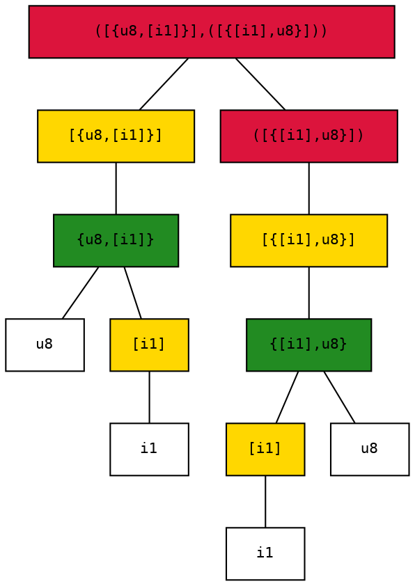
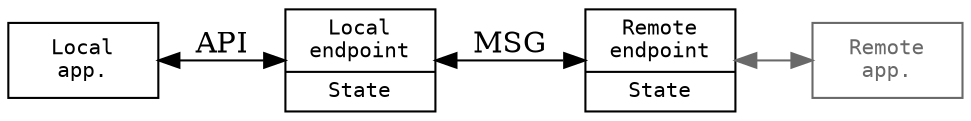

Lighweight Remote Procedure Calls
=================================

The solution is comprised of two main functional blocks:

 - A platform and language agnostic serialization format that enalbles transforming structured data to and from a byte sequence.
 - An established protocol that uses these serialized messages to implement higher level functions.

 ```dot
graph G
{
    node [shape=record, penwidth=0.5, fontcolor="dimgray", fontname="mono", width=2, fontsize=12];
    edge [color="dimgray"];
    app[label="Application"]
    rpc[shape=record, label="{RPC protocol|Serialization \nsublayer}", penwidth=1, fontcolor=""]
    tcp[label="{Message\ntransport\nadapter|Byte stream \ntransport}"]
    udp[label="{Message\ntransport\nadapter|Datagram \ntransport}"]

    app--rpc []
    rpc--tcp
    rpc--udp
}
 ```

 Serialization
 -------------

 The serialization solution utilizes a strongly typed data representation, meaning that it defines an abstract (language independent) data type system and each message has an associated type to it.

 Messages can only be (de)serialized knowing their type, in other words the messages are not self-describing. The purpose of this serialization format is to serve the needs of the RPC protocol, ergo the messages are not meant to be processed out of context. It is beneficial to spare the extra resources that could be used to send meta-information already known by the intended target.

### Type system

All types can be represented as a tree, whose nodes can be aggregates, collections, typed method handles or - at the leaves only - primitive types.

#### Nodes

|            |  Children  |  Textual representation  |
| ---------- | ---------- | ------------------------ |
| Integral   |      -     |  i1, u1, i2, u2, i4, ... |
| Aggregate  |  Members   |  {T, U, V, ...}          |
| Collection |  Elements  |  [T]                     |
| Method     |  Arguments |  (T, U, V, ...)          |

##### Integral primitives

There are eight integral primitives, representing signed/unsigned integral values of 1, 2, 4 and 8 bytes.

##### Aggregates 

An aggregate is a compund data record consisting of a list of values with predefined types and order between them. It is similar to a C/C++/C# _struct_.

The aggregate type-node can have zero or more children.

##### Collection

A collection is a heterogeneous batch of data with an arbitrary number of elements. Although the count of its elements is not known, the type of the must be defined a priori.

The collection type-node has exactly one child.

##### Method handle

A method handle is a type that has associated children type-nodes, that represent the arguments of a function call. However contrary to the aggregate the value it represents is not the arguments themselves but a handle that can be used to invoke a method that takes exactly those arguments.

The method type-node can have zero or more children.

#### Type signatures

For every type-tree exists a mutually unique string representation, called its type signature. The rules for this bijection are type-node specific.

##### Integral primitives

The string representation of an integral primitive is two character:

 - the first of which represents signedness: **u** for unsigned and **i** (as integer) for signed;
 - the second is the size in the number of bytes used to store the value, it can be 1, 2, 4 or 8.

For example **i1** is the signature of a sigle byte signed integer (C/C++ _char_, C# _sbyte_ or Java _byte_)

##### Aggregates 

The string representation of an aggregate is the type signature of its children (in order), separated by a comma **,**  (without white space on either side) between curly brackets.

For example **{i4,u8}** the signature of is an aggregate that is made up of a four byte signed integer and an eight byte unsigned integer - in that order.

##### Collection

The type signature of a collection is that of its element type between square brackets.

For example **[i1]** is the signature of a collection of one byte signed integers (which can be interpreted as a character string).

##### Method handle 

The string representation of a method handle is the type signature of the arguments types (in order), separated by a comma **,**  (without white space on either side) between parentheses (round brackets).

For example **(u4, [i1])** is the signature of a handle for a method that takes a four byte unsigned integer and collection of signed single bytes - in that order.

#### Encoding

The serialized encoding of a value is determined by its type. The overall structure of the byte sequence corresponding to a value can be understood as being generated by a depth-first traversal of the type tree.

##### Integral primitives

Basic integral values are serialized using full width, least-significant-byte-first (little-endian, LSB first) encoding, which is very close to the most natural in-memory representation considering modern CPUs.

An additional requirement for efficeint CPU acces would be aligned base addresses for multi-byte values. But ensuring proper alignment could only be done by adding padding bytes in the general case, which is acceptable for in-memory usage but can easily be too wasteful for an over-the-wire format in certain bandwidth constrained usecases.

##### Aggregates 

Aggregate typed values are serialized as a sequence of its constituent member values - in order, without any additional framing.

##### Variable length encoding

Several - typically lower volume - data items are serialized using a variable length encoding, that assigns a shorter representation to smaller numbers. The serialization engine uses only 32-bit unsigned values encoded this way. These four byte values are encoded into 1-5 bytes based on the numerical value.

The encoding produces one byte at a time for 7 bit chunks of the original value. The least significant bits of the output byte are the inputs bits, the top bit is signifies if there are more chunks following.

During encoding the least significant part is processed first, the last 7 bits are taken from the input:

  - if the remaining value is zero, then there are no more parts required, so the output is the 7 input bits at the lower part and a zero at the topmost bit. The processing stops
  - if the remaining value is not zero, then there are more parts to come, so the output is the 7 input bits at the lower part and a one at the topmost bit. The processing continues the same way for the consequent 7 bits of the input.

| Value range        |  Input bits (as 32-bit word)     | Output bytes (in proper sequence)            |
|--------------------|----------------------------------|----------------------------------------------|
| 0 <= x < 128       | 0000000000000000000000000aaaaaaa | 0aaaaaaa                                     |
| 128 <= x < 128^2   | 000000000000000000aaaaaaabbbbbbb | 1bbbbbbb 0aaaaaaa                            |
| 128^2 <= x < 128^3 | 00000000000aaaaaaabbbbbbbccccccc | 1ccccccc 1bbbbbbb 0ccccccc                   |
| 128^3 <= x < 128^4 | 0000aaaaaaabbbbbbbcccccccddddddd | 1ddddddd 1ccccccc 1bbbbbbb 0aaaaaaa          |
| otherwise          | aaaabbbbbbbcccccccdddddddeeeeeee | 1eeeeeee 1ddddddd 1ccccccc 1bbbbbbb 0000aaaa |
 
This encoding is sometimes called LEB128 which stand for little endian base 128.

##### Collections 

Collections are encoded as sequence of their element values perepended by the number of contained elements using the variable length encoding specified above.

##### Method handles

Method handles are unsigned 32-bit values used by the upper protocol layer as an identifier for the actual method to be invoked. It is using the variable length encoding specified above.

#### Example

A method that takes a set of number to string mappings, and returns string to number mappings via a callback could be represented by this signature: 

      ([{u8,[i1]}],([{[i1],u8}]))

Which is equivalent to this type tree:



Type-nodes are color coded according their kind:

 - Red nodes are method handles,
 - Green are aggregates,
 - Yellow means collection,
 - The white ones are integral primitives.

A value of this type is a 32-bit unsigned integral which is encoded using the variable length encoding scheme.

However if a method with the this signature is invoked its arguments are serialized as an aggregate of the arguments, like this:

```ditaa {cmd=true args=["-E","-S"]}
+---------------+-----------+--------+-----------+------------+
|               |  8 bytes  | string | character |            |
|  num elements |  unsigned | length +-----------+ callback   |
|  in first arg |  integral | varint |  n times  | identifier |
|  varint       +-----------+--------+-----------+ varint     |
|               |       num elements times       |            |
+---------------+--------------------------------+------------+
```

The invocation of the callback has the following byte sequence format:

```ditaa {cmd=true args=["-E","-S"]}
+----------------+----------+-----------+-----------+
|                | string   | character |  8 bytes  |
|  num elements  | length n +-----------+  unsigned |
|  in collection | varint   |  n times  |  integral |
|  varint        +----------+-----------+-----------+
|                |       num elements times         |
+----------------+----------------------------------+
```

Protocol
--------

The RPC protocol is defined in terms of endpoint state and interactions with the application and the remote endpoint.

The direction of connection establishment is irrelevant, the two ends of the connection function in exactly the same way.



The operation can be further divided in two logical layers:

 - Basic remote procedure invocation,
 - Signature based symbolic method lookup/linking.

```ditaa {cmd=true args=["-E","-S"]}

+----------------------------------+
|                                  |
|            Application           |
|                                  |
+-----------------+                |
| Symbolic lookup |                |
+-----------------+-------+        |
| Remote invocation layer |        |
+-------------------------+        |
|     Serialization       |        |
+-------------------------+--------+
|    Message transport adapter     |
+----------------------------------+
```

### Remote procedure invocation layer

The lower protocol layer enables the remotely triggered execution of methods registered by the local application and the upper protocol layer.

#### Endpoint state

The endpoint stores internal state regarding to registered methods and the associated identifiers required for remote invocation.

For each registered method there is a 32-bit unsigned numeric value that identifies the method uniquely. During assignment of an identifier the engine chooses the smallest possible value while also avoiding reuse as to circumvent confusion of different methods being registered at different times.

#### Protocol messages

Every message exchanged by the endpoints follow the same format and have the same effect as far as the invocation layer is concerned. It contains the identifier for the method to be invoked at the remote end. The identifier is key in the remote endpoints registry of methods, so it either has to:

 - identify a well-known method or
 - be retrieved earlier from the remote endpoint.

The identifier of the method is the first item in the message followed by the arguments to be used for the invocation. These values are serialized as if, they were an aggregate of a method handle and all the arguments of the method, formally it has the type signature:

    {(T...),T...}

Where _T_ is the list of argument types for the target method, and _..._ means list expansion. For example if a method with string argument is to be invoked, it becomes:

    {([i1]),[i1]]}

Upon receiving a message the endpoint deserializes method identifier at the beginning of the byte sequence and using that information it can look up the corresponding method. Using that knowledge it can deserialize the arguments and execute the target.

#### Application interface

The appliction is provided with the following operations regarding basic remote invocation functions:

 - **install** a local method to be available for remote invocation,
 - **uninstall** a previously registered method,
 - **call** a remote method registered by the remote application at the remote RPC endpoint.

### Symbolic method lookup

Type safety can be achieved by utilizing method signature based symbolic method lookup. The signature of a public method consists of a textual name and the type signature of a handle to that method.

For example a method named _foo_ receiving a list of strings has a signature:

    foo([[i1]])

In order for an application to be able to utilize some  remotely provided functionality it must known the semantics of that service, including the relevant structure of the data to be sent during invocation of remote methods. Thus, it can be assumed that it is able to issue fully qualified method signatures as a basis for looking up remote methods. It is also valid a assumption the other way around: the public interface of service can only be specified in terms of well defined data structures.

To achieve type safety, it is enough for both ends to adhere to the proper data handling procedures waranted by the signature of interface methods.

#### Related endpoint state

Exported procedures must be available for remotely triggered execution as well, so they must be registered at the invocation layer. Thus, all publicly available bear an identifier as well. In addition to that the endpoint stores published method available for the other end. The registry required for this equivalent of mapping from method signature to handles.

#### Protocol messages

A public method can be looked up via a proper remote call registered with a well-known identifier 0. This is the lookup method, although not registered as public method it has the theoretical signature:

    lookup([i4],(u4))

This procedure tries to find the published method whose signature is passed to it as the first argument and provides the result in the form of a callback issued to the method identified by the second argument. It passes the identifier corresponding to the requested symbol (an unsigned 32-bit value) to the callback as its first any only argument if the lookup was succesful. In case of an error it returns with the value 0xffffffff (all bits set, -1u).

#### Application interface

The appliction is provided with the following operations regarding signature based symbolic lookup:

 - **provide** a local method as the definition of a symbol,
 - **discard** the previously provided method for a specific symbol,
 - **lookup** a the handle for a symbol provided by the remote application at the remote RPC endpoint.
